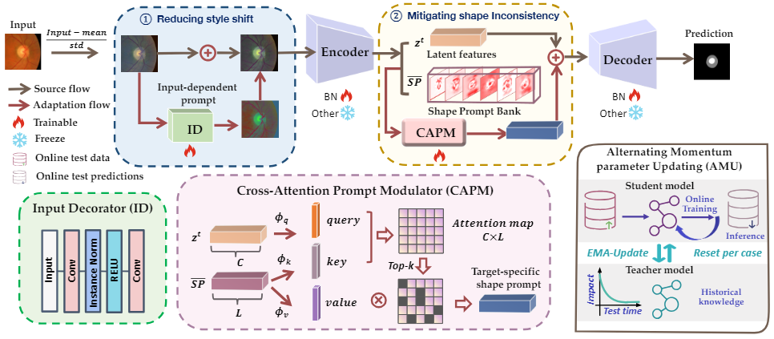

# PASS
<div align=center></div>

[**_PASS:Test-Time Prompting to Adapt Styles and Semantic Shapes in Medical Image Segmentation_**](https://ieeexplore.ieee.org/document/10812757)

> By Chuyan Zhang, Hao Zheng, Xin You, Yefeng Zheng, Yun Gu
>> Institute of Medical Robotics, Shanghai Jiao Tong University
>> Department of Automation, Shanghai Jiao Tong University, Shanghai, China


This is the official pytorch implementation of PASS.

Dependencies:
- torch, 1.13.1
- torchvision, 0.14.1  
- python, 3.7.9
- numpy，1.19.2 


Our codebase contains the proposed PASS method and several compared baselines: 

PTBN[1]/TENT[2]/TIPI[3]/DUA[4]/CoTTA[5]/SAR[6]/OCL-TTT[7]/ProSFDA[8]/DAE[9]/DPG[10]/RN-CR[11]/AdaMI[12]/VPTTA[13]

1. test_time_training_offline

- TENT/RN-CR/AdaMI (outer_tta.py)
- OCL-TTT (test_time_training_offline/ocl_tta.py)
- ProSFDA (test_time_training_offline/prosfda.py)
- PASS (sptta_{dataset}.py}

2. test_time_training_online

- PTBN/TENT/TIPI/DUA/CoTTA/SAR (inner_tta.py)
- RN-CR/AdaMI (outer_tta.py)
- DAE (dae_tta.py)
- DGP (dpg_tta.py)
- VPTTA (vptta_{dataset}_online.py}
- PASS (sptta_{dataset}_online.py}

## Reference

[1] Nado Z, Padhy S, Sculley D, et al. Evaluating prediction-time batch normalization for robustness under covariate shift[J]. arXiv preprint arXiv:2006.10963, 2020.

[2] Wang D, Shelhamer E, Liu S, et al. Tent: Fully test-time adaptation by entropy minimization. ICLR, 2020.

[3] Nguyen A T, Nguyen-Tang T, Lim S N, et al. Tipi: Test time adaptation with transformation invariance[C]//Proceedings of the IEEE/CVF Conference on Computer Vision and Pattern Recognition. 2023: 24162-24171.

[4] Mirza M J, Micorek J, Possegger H, et al. The norm must go on: Dynamic unsupervised domain adaptation by normalization[C]//Proceedings of the IEEE/CVF conference on computer vision and pattern recognition. 2022: 14765-14775.

[5] Wang Q, Fink O, Van Gool L, et al. Continual test-time domain adaptation[C]//Proceedings of the IEEE/CVF Conference on Computer Vision and Pattern Recognition. 2022: 7201-7211.

[6] Niu, Shuaicheng, et al. "Towards Stable Test-time Adaptation in Dynamic Wild World." ICLR, 2023.

[7] Zhang Y, Sun Y, Zheng S, et al. Test-Time Training for Semantic Segmentation with Output Contrastive Loss[J]. arXiv preprint arXiv:2311.07877, 2023.

[8] Hu S, Liao Z, Xia Y. Prosfda: Prompt learning based source-free domain adaptation for medical image segmentation[J]. arXiv preprint arXiv:2211.11514, 2022.

[9] Karani N, Erdil E, Chaitanya K, et al. Test-time adaptable neural networks for robust medical image segmentation[J]. Medical Image Analysis, 2021, 68: 101907.

[10] Valanarasu J M J, Guo P, Vibashan V S, et al. On-the-fly test-time adaptation for medical image segmentation[C]//Medical Imaging with Deep Learning. PMLR, 2024: 586-598.

[11] Hu M, Song T, Gu Y, et al. Fully test-time adaptation for image segmentation[C]//Medical Image Computing and Computer Assisted Intervention–MICCAI 2021.

[12] Bateson M, Lombaert H, Ben Ayed I. Test-time adaptation with shape moments for image segmentation[C]//International Conference on Medical Image Computing and Computer-Assisted Intervention. Cham: Springer Nature Switzerland, 2022: 736-745.

[13] Chen Z, Ye Y, Lu M, et al. Each Test Image Deserves A Specific Prompt: Continual Test-Time Adaptation for 2D Medical Image Segmentation. CVPR, 2024.

## Acknowledgements

The whole framework is built upon and inspired by the following codebase:


- https://github.com/ShishuaiHu/ProSFDA
- https://github.com/mathilde-b/TTA
- https://github.com/neerakara/test-time-adaptable-neural-networks-for-domain-generalization
- https://github.com/jeya-maria-jose/On-The-Fly-Adaptation
- https://github.com/mr-eggplant/SAR
- https://github.com/Chen-Ziyang/VPTTA


Citation:
```bibtex
@article{zhang2024pass,
  title={PASS:Test-Time Prompting to Adapt Styles and Semantic Shapes in Medical Image Segmentation},
  author={Zhang, Chuyan and Zheng, Hao and You, Xin and Zheng, Yefeng and Gu, Yun},
  journal={IEEE Transactions on Medical Imaging},
  year={2024},
  publisher={IEEE}
}
```
